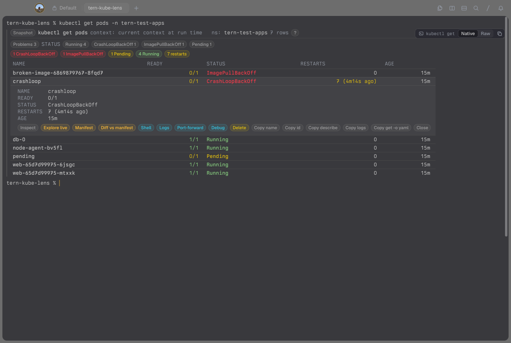
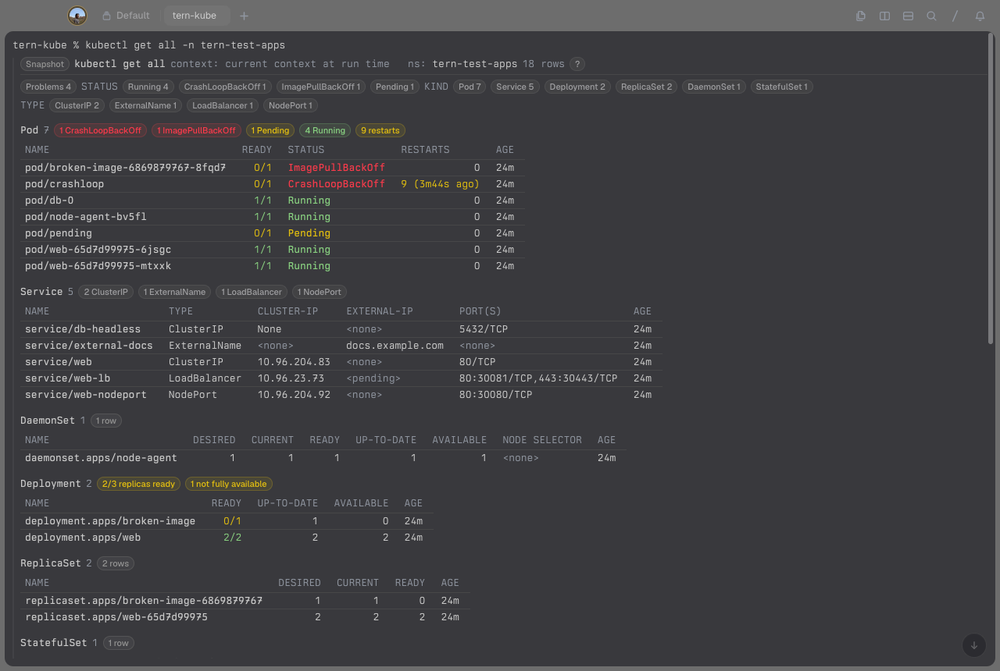
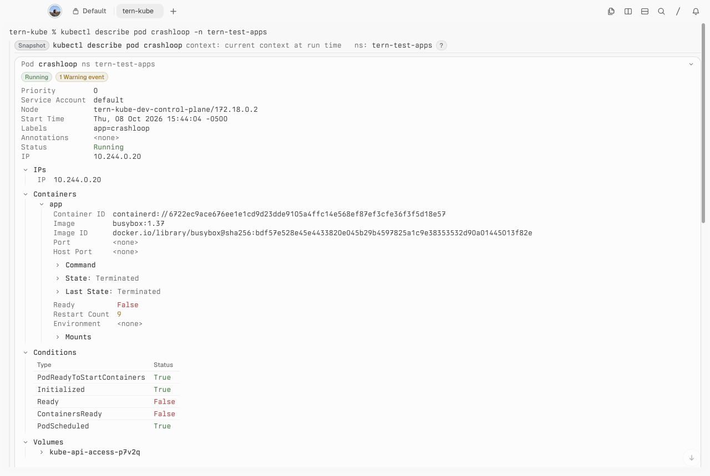
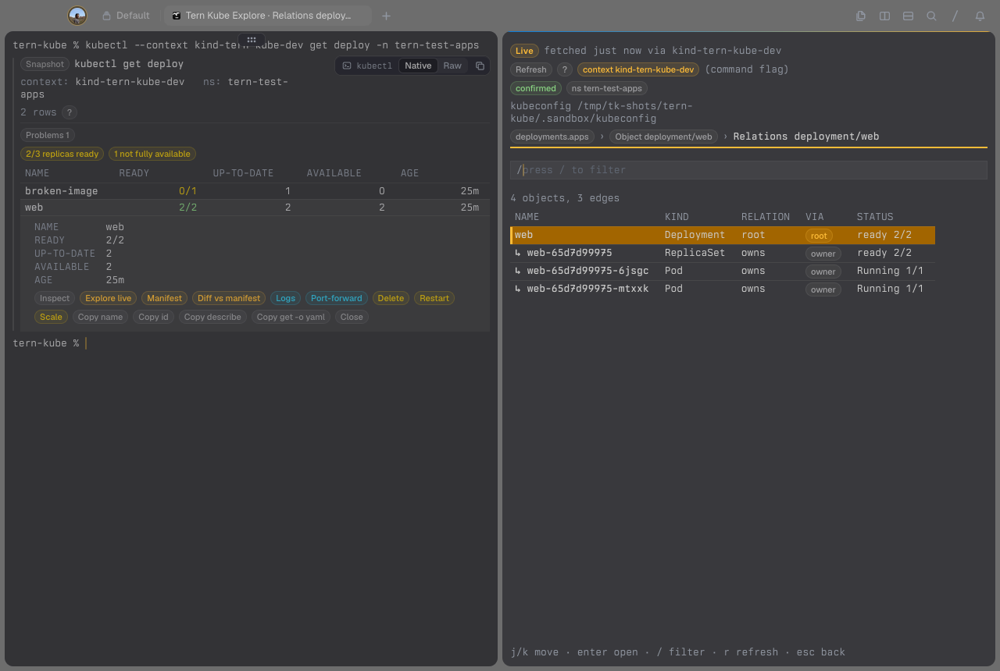
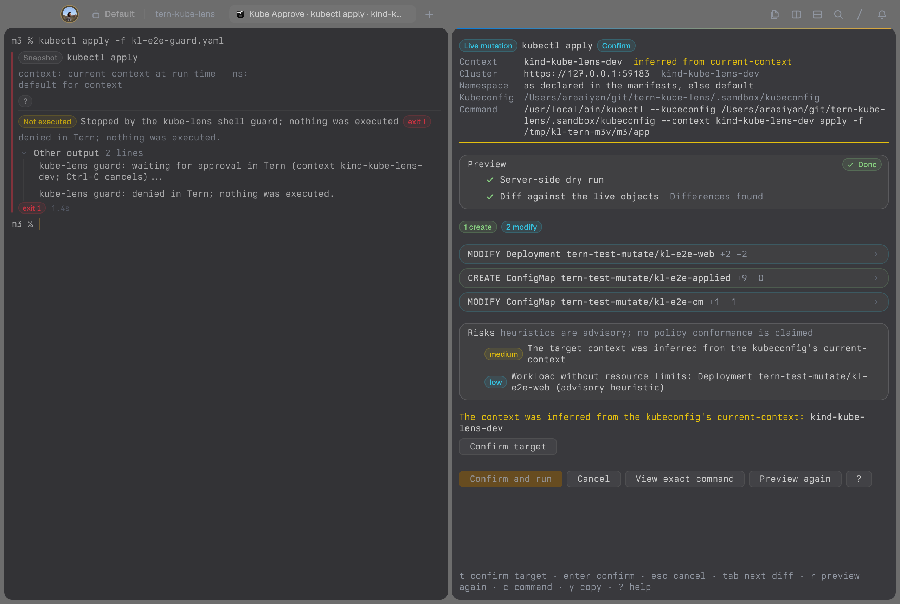
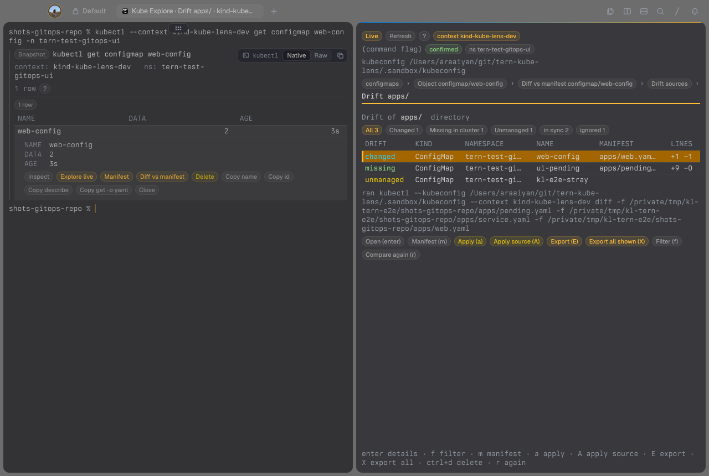

# tern-kube

**Tern Kube** reads `kubectl` output in [Tern](https://stencil.so/tern) as
native views: sortable, filterable tables you can click into, with the
original output one click away (**Raw**).



> Public beta, in active development. See [Features](#features) for what is done and what v1.0 adds.

- **Click a column** to sort. Ages, quantities, ratios and restarts sort by
  value, not text.
- **Click a row** for an inline inspector; **Inspect** shows every field,
  the source line and, with `-o json`, the object tree.
- **Filter chips** by status, namespace and kind, plus **Problems**
  (failing, not ready, restarting).
- **Copy** the name, a qualified id, or a ready `describe`, `logs` or
  `get -o yaml` command for the same context and namespace.
- `describe` renders as cards with an events timeline, `-o yaml` as a
  document list, and `apply` / `delete` / `scale` / `rollout restart` as a
  result summary (a result, never a preview).
- Secret values are masked in the native view.
- Output it cannot render faithfully (`-w`, `-o jsonpath`, very large
  output) stays raw.

It claims `kubectl` and `kubecolor` running `get`, `describe`, `top`,
`apply`, `delete`, `rollout restart` and `scale`, also after global flags
(`kubectl --context prod -n web get pods`), and takes over from Tern's
built-in `kubectl get` lens. Pipelines and redirected output are never
lensed.

| `get all` | `describe` |
| --- | --- |
|  |  |

## Explore

**Explore live** on a row, or **Tern Kube: Explore** in the palette, opens a
live block beside the pane. It pins the context it queries, shows where that
context came from, and only refreshes when you ask.



| Keys | |
| --- | --- |
| `j` `k` `gg` `G` `enter` `esc` | move, open, back |
| `/` | filter |
| `d` `y` `L` `R` | describe, object, last logs, relations |
| `s` `l` `shift+f` | shell, follow logs, port-forward in a split |
| `c` `n` `:` | context, namespace, kind |
| `ctrl+d` `ctrl+r` `shift+s` | delete, rollout restart, scale |
| `r` `Y` `?` | refresh, copy the command, help |

Shell, logs and port-forward are also chips in the lens inspector (two
clicks from any row). They open beside the pane by default; see
[configuration](docs/configuration.md).

## Changes

Delete, restart, scale, debug, CronJob run-now (Explore keys or inspector
chips) and **Tern Kube: Apply file or directory** open an approval block
first: server dry run, `kubectl diff` per resource, then a confirmation
scaled to the risk. Deletes and other broad changes need the target typed.
Nothing runs if the preview fails or the inputs or target change before
you confirm.



Typed commands can get the same preview with the opt-in shell guard for
zsh, bash and fish: `kubectl apply`, `delete`, `scale` and
`rollout restart` wait for your approval in Tern; everything else runs
untouched. It is a seatbelt, not a policy: `command kubectl` and scripts
bypass it. Setup: [shell/README.md](shell/README.md).

## GitOps

Explore knows the git repository you ran the command in: `m` opens an
object's manifest at its line, `=` diffs it against the live object,
`ctrl+g` reports drift for a directory, Kustomization, Helm release or a
locally checked out Argo CD / Flux app (changed, missing, unmanaged), and
`E` exports live objects as clean manifests, optionally onto a new branch
and commit. Push and pull requests are off unless you turn them on.



Outside Tern, [`bin/tern-kube-drift`](bin/tern-kube-drift) produces the same
report for CI ([example workflow](examples/ci/github-actions-drift.yml)).
Details: [docs/gitops.md](docs/gitops.md).

## Install

```sh
tern plugin install github.com/contrafy/tern-kube
```

Installing copies the whole repository (about 6 MB); Tern loads only
`plugin.toml` and `plugin/`.

Requires Tern 0.6.2 or later with shell integration and native command
output on (`command_lenses`, the default), and `kubectl` on your `PATH`.
Tested on macOS; Tern on Linux and remote hosts is not verified yet (see
[Features](#features)).

The shell guard, `tern-kube-drift` and the bash/fish alias helper live
outside the plugin; clone the repository for those:

```sh
git clone https://github.com/contrafy/tern-kube
tern-kube/scripts/tern-kube-aliases add k   # bash/fish only; zsh expands aliases itself
```

Settings: **Tern Kube: Settings** in the palette, or edit
`~/.config/tern-kube/config.json` ([configuration](docs/configuration.md)).

To remove: `tern plugin remove tern-kube`.

## Features

v1.0 is when every row reads done. Release history: [CHANGELOG.md](CHANGELOG.md).

| Feature | Status |
| --- | --- |
| **Lens** | |
| `get`, `describe`, `top`, mutation results as native views | done |
| Claims `kubectl` and `kubecolor`, also after global flags | done |
| Typed column sort; status, namespace, kind, Problems filters | done |
| Inline row inspector and full Inspect view | done |
| Copy name, id, `describe`/`logs`/`get -o yaml` command | done |
| `describe` cards with events; YAML list; JSON tree | done |
| Secrets masked; raw fallback for watches, jsonpath, huge output | done |
| Narrow-window columns; view state survives plugin reload | done |
| Native `kubectl logs` lens | planned |
| **Explore** | |
| Live block with pinned context and its provenance | done |
| k9s-style keys; context, namespace and kind pickers | done |
| Describe, object, last 500 log lines | done |
| Relations graph with provenance | done |
| Namespace events timeline | planned |
| Helm releases with history | planned |
| Compare one object across contexts | planned |
| **Quick actions** | |
| Pod shell; workloads pick a ready pod | done |
| Follow logs; workloads by selector, all containers | done |
| Port-forward with port picker and local port suggestion | done |
| Debug container, node debug pod, CronJob run now | done |
| New split (right, down) or tab; context and kubeconfig pinned | done |
| **Changes (mutations)** | |
| Delete, rollout restart, scale from Explore keys or lens chips | done |
| **Tern Kube: Apply file or directory**, Kustomize included | done |
| Approve block: server dry run, per-resource `kubectl diff` | done |
| Risk tiers; re-verifies argv, target and files before running | done |
| JSON-lines audit log | done |
| `rollout undo`/`pause`/`resume`, `patch`, `label`, `annotate` | planned |
| `cordon`, `uncordon`, `drain`; `edit` as preview then apply | planned |
| Helm rollback through the approve block | planned |
| **Shell guard** | |
| Opt-in for zsh, bash and fish; one POSIX `sh` core | done |
| Guards `apply`, `delete`, `scale`, `rollout restart` | done |
| Fails closed outside Tern, on timeout or mismatch | done |
| Guards the planned verbs above | planned |
| **GitOps** | |
| Manifest index: YAML, Kustomize, configured Helm releases | done |
| Open manifest at its line; diff vs live object | done |
| Drift report: changed, missing, unmanaged; apply via approve | done |
| Argo CD / Flux owner, sync and health status | done |
| Export clean manifests; Secrets as placeholders | done |
| Branch and commit; push and `gh pr create` opt-in | done |
| `tern-kube-drift` CLI (text, Markdown, JSON) and CI example | done |
| Helm values diff and chart auto-detect | planned |
| Compare one source against several clusters | planned |
| **Settings and config** | |
| Versioned JSON at `~/.config/tern-kube/config.json` | done |
| **Tern Kube: Settings**: validation, reset, status checks | done |
| Opt-in bash/fish alias claims (`tern-kube-aliases`) | done |
| Mutation and live-query switches, timeouts, limits | done |
| **Platform** | |
| Tern on macOS; CI on macOS arm64 and Linux x86_64 | done |
| Tern on Linux | planned |
| Remote SSH hosts | planned |
| fish as login shell | planned |

| Kind | Lens | Relations | Shell/logs | Port-fwd | Restart/scale | Delete | Manifest |
| --- | --- | --- | --- | --- | --- | --- | --- |
| Pods | done | done | done | done | - | done | done |
| Deployments | done | done | done | done | done | done | done |
| StatefulSets | done | done | done | - | done | done | done |
| DaemonSets | done | done | done | - | done | done | done |
| ReplicaSets | done | done | done | - | done | done | done |
| Jobs | done | done | done | - | - | done | done |
| CronJobs | done | done | - | - | - | done | done |
| Services | done | done | - | done | - | done | done |
| Ingresses | done | done | - | - | - | done | done |
| Nodes | done | partial | done | - | - | done | - |
| Namespaces | done | - | - | - | - | done | done |
| ConfigMaps | done | partial | - | - | - | done | done |
| Secrets | done | partial | - | - | - | done | done |
| Events | done | - | - | - | - | - | - |
| Custom resources | done | partial | - | - | - | done | done |
| Helm releases | - | planned | - | - | - | - | partial |

`-`: not applicable or outside v1.0. partial: Nodes, ConfigMaps and Secrets
appear only as relations of Pods; custom resources show owners only; Helm
releases diff and drift but do not export. Node shell is a debug pod.

## Development

```sh
make bootstrap   # pinned tools into .tools/
make check       # format, lint, typecheck, unit tests, benchmark
make e2e         # drives an isolated Tern window; needs Docker
tern plugin link .   # load the checkout in place; reloads on save
```

`make e2e` runs against a disposable [kind](https://kind.sigs.k8s.io)
cluster (`scripts/cluster.sh create`) and refuses any other context.

More: [architecture](docs/architecture.md), [security model](docs/security-model.md),
[testing](docs/testing.md), [SDK capability matrix](docs/sdk-capability-matrix.md),
[performance](docs/performance.md), [contributing](CONTRIBUTING.md).

## License

[MIT](LICENSE)
